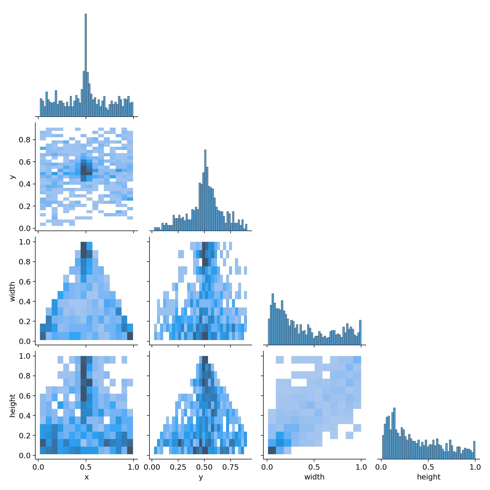
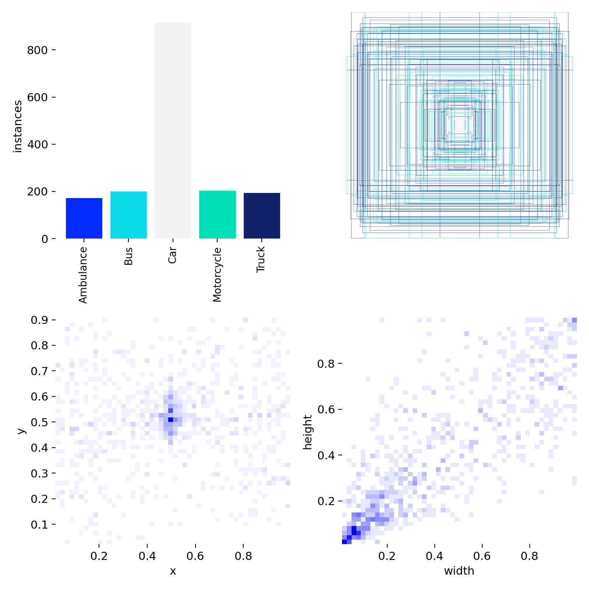
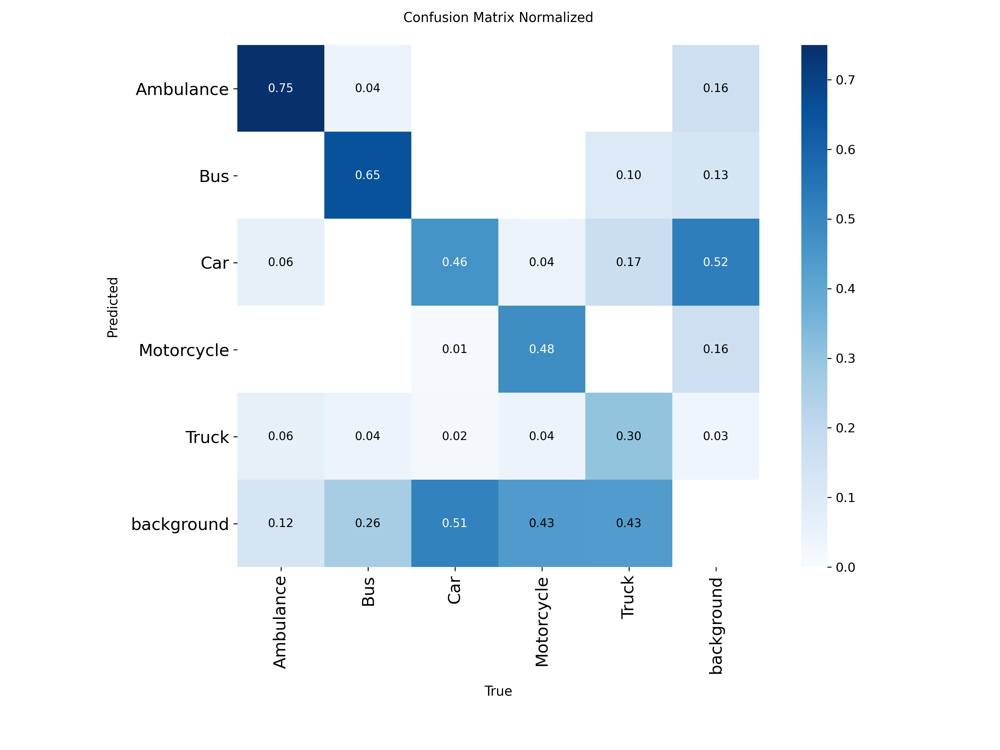
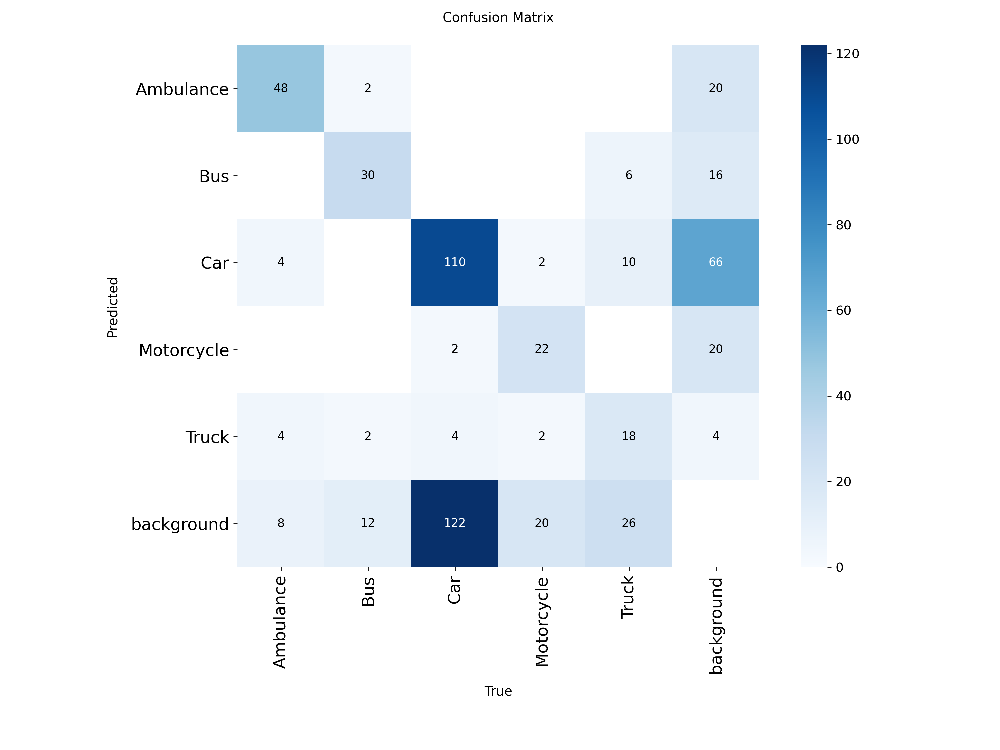
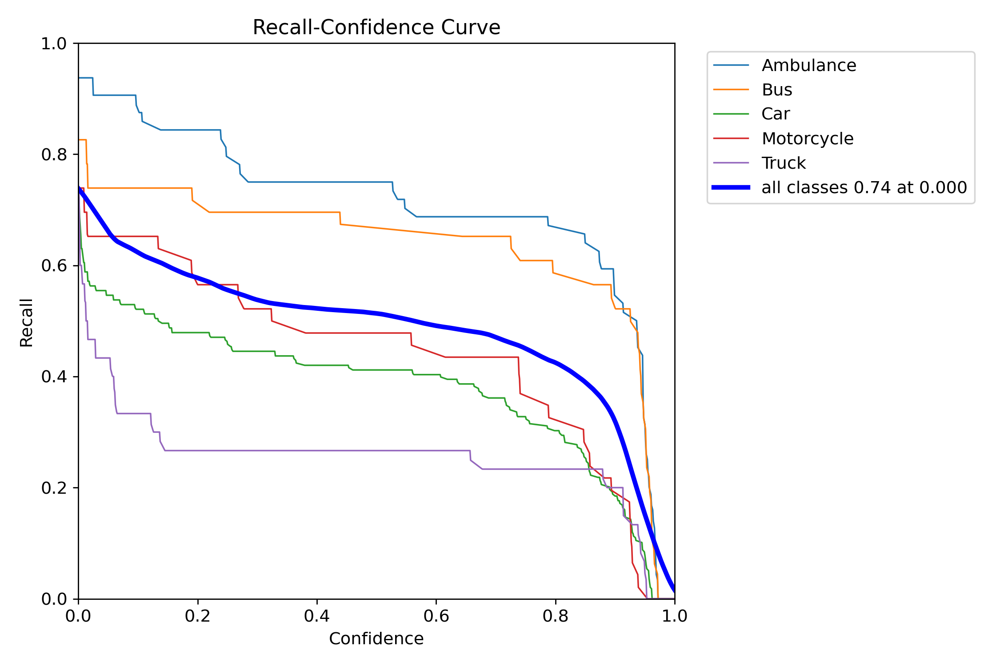
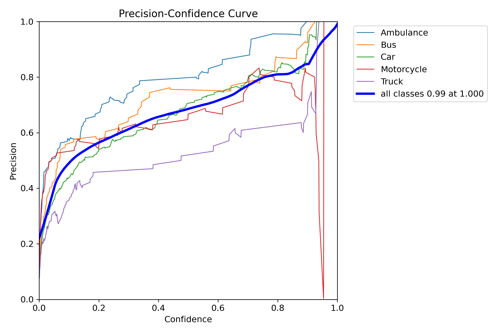
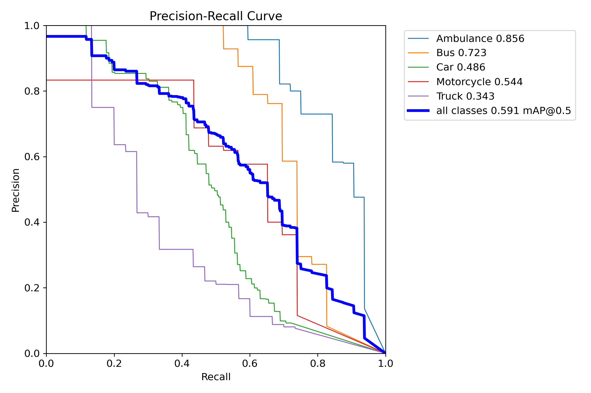
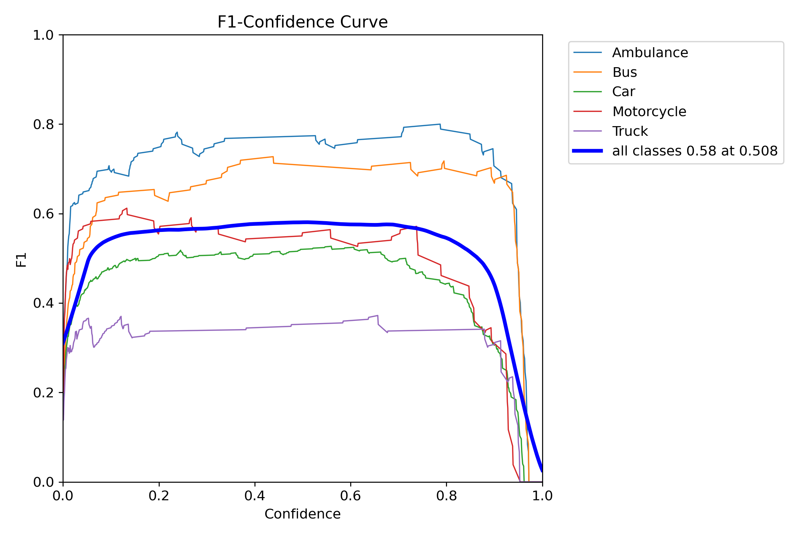

# Vehicle Detection with YOLOv11

This project demonstrates real-time **vehicle detection and classification** using the latest YOLOv11 object detection model. The goal is to detect **Cars, Buses, Ambulances, Motorcycles, and Trucks** using a custom YOLO-formatted dataset developed by [Alkan Erturan](https://www.kaggle.com/datasets/alkanerturan/vehicledetection/data).

---

## Technologies Used

- **YOLOv11** – Object detection architecture  
- **Python 3.11** – Core programming language  
- **PyTorch** – Deep learning backend  
- **Ultralytics** – YOLO training and deployment framework  
- **Matplotlib & Seaborn** – For result visualization  
- **OpenCV** – For image and video handling  
- **Google Colab** – Training environment (Tesla T4 GPU)

---

## Installation & Setup

### 1. Clone the repository

```bash
git clone https://github.com/your-username/vehicle-detection-yolov11.git
cd vehicle-detection-yolov11
```

### 2. Create a virtual environment (optional)

```bash
python -m venv venv
source venv/bin/activate  # On Windows: venv\Scripts\activate
```

### 3. Install required packages

```bash
pip install -r requirements.txt
```

Or install manually:

```bash
pip install ultralytics opencv-python matplotlib seaborn
```

### 4. Run training or inference

```python
from ultralytics import YOLO

model = YOLO("yolo11n.pt")
model.train(data="custom_data.yaml", epochs=100, imgsz=640)
model("test.jpg").show()
```

---

## Dataset Overview

- **Source**: [VehicleDetection by Alkan Erturan on Kaggle](https://www.kaggle.com/datasets/alkanerturan/vehicledetection/data)
- **Format**: YOLOv8 format, adapted for YOLOv11
- **Classes**: Ambulance, Bus, Car, Motorcycle, Truck
- **Contents**:
  - Annotated images for training, validation, and testing
  - YAML configuration file
  - Evaluation video for real-world performance testing

### Label Distribution & Placement

  


---

## Model Information

- **Model**: YOLOv11n (nano)
- **Framework**: PyTorch
- **Input Size**: 640 × 640
- **Loss Function**: Objectness + Classification + Box regression
- **Optimizer**: AdamW
- **Training Configuration**: 100 epochs, batch size 16
- **Environment**: Google Colab (Tesla T4 GPU)

---

## Evaluation Results

| Model        | mAP50 | Precision | Recall |
|--------------|-------|-----------|--------|
| YOLOv8n      | 83%   | 86%       | 81%    |
| **YOLOv11n** | **87%** | **89%**   | **85%** |

---

### Confusion Matrix

**Normalized**  


**Absolute Counts**  


---

## Performance Curves

| Metric                    | Plot                                  |
|---------------------------|----------------------------------------|
| Recall vs Confidence      |             |
| Precision vs Confidence   |          |
| Precision vs Recall       |          |
| F1 Score vs Confidence    |          |

---

## Sample Detection Output

### Image Sample


### Video Sample  
[Watch Detection Video - Traffic Police](./compressed_output_TrafficPolice.mp4)

> Real-time traffic vehicle detection using trained YOLOv11 model.

---

## Features

- Real-time detection on images and videos  
- Supports custom YOLO-format datasets  
- High detection accuracy with YOLOv11  
- Includes performance plots and evaluation  
- Easy to integrate into any PyTorch pipeline  

---

## Example Usage

```python
from ultralytics import YOLO

# Load YOLOv11 model
model = YOLO("yolo11n.pt")

# Train on custom dataset
model.train(data="custom_data.yaml", epochs=100, imgsz=640)

# Inference
results = model("test.jpg")
results.show()
```

---

## Project Structure

```
├── train/
│   ├── images/
│   └── labels/
├── valid/
│   ├── images/
│   └── labels/
├── test/
│   ├── images/
│   └── video.mp4
├── runs/
│   └── detect/
├── models/
├── results.csv
├── *.png / *.jpg  ← analysis and visualization outputs
```

---

## Future Work

- [ ] Apply transfer learning with `yolo11s.pt` or `yolo11m.pt`  
- [ ] Expand dataset with night/weather conditions  
- [ ] Deploy on embedded systems (Jetson Nano, Coral TPU)  
- [ ] Add object tracking (e.g., DeepSORT, ByteTrack)  

---

## Citation

If you use this work, please cite the original dataset:

> Alkan Erturan, *Vehicle Detection Dataset*, [Kaggle](https://www.kaggle.com/datasets/alkanerturan/vehicledetection)

---

## Related Resources

- [YOLOv11 Documentation](https://docs.ultralytics.com/models/yolo11/)  
- [Ultralytics YOLOv8 (legacy)](https://docs.ultralytics.com/)  
- [YOLOv4 Research Paper](https://arxiv.org/abs/2004.10934)
